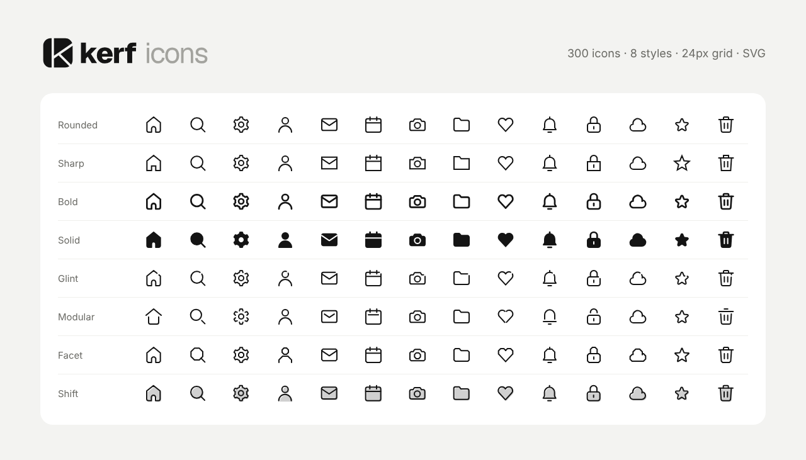

<p align="left"></p>

300 minimal icons in 8 styles, drawn on a 24px grid. Free to use in your designs and products. Every style carries its own small cut, which is where the name comes from: a kerf is the thin gap a blade leaves behind.



## Styles

| Style | What makes it different |
|---|---|
| Rounded | 1.5px stroke, round caps and joins. The default. |
| Sharp | Square caps and mitered corners. |
| Bold | 2px stroke for small sizes and heavy UI. |
| Solid | Filled shapes with cut-out details. |
| Glint | One small gap at the top right of the main shape. |
| Modular | Strokes stop short of each other where they meet. |
| Facet | Curves become flat facets and corners become chamfers. |
| Shift | A 20% tint offset behind the outline. |

## Categories

Interface (50), Arrows (40), Users (20), Communication (25), Files and Folders (30), Editing (35), Media (30), Devices (20), Security (15), Status (15), Time and Calendar (20).

## Using the icons

Every icon is a 24×24 SVG that uses `currentColor`, so it takes the text color of wherever you put it.

**Download** any file from `svg/<style>/<name>.svg`, for example `svg/rounded/home.svg`.

**Link from the CDN**:

```html

```

**Bundles**: `dist/<style>.json` holds every icon of one style as `{ "name": "<svg>" }`, and `dist/meta.json` lists names, categories and search tags. Handy if you're building a picker or a tool on top of the set.

## Releasing a new version

1. Update the icons in `svg/` and `dist/`, and bump `version` in `dist/meta.json` and `package.json`.
2. Commit, then tag the release: `git tag v1.1.0 && git push --tags`
3. CDN links that use `@1` pick up every 1.x release automatically. jsDelivr can take up to 12 hours to see a new tag.

## Repository layout

```
brand/      Logo, mark and wordmark
svg/        2,400 SVG files, one folder per style
dist/       JSON bundles of every style, plus meta.json
assets/     Images for this README
```

## License

MIT. See [LICENSE](LICENSE).
